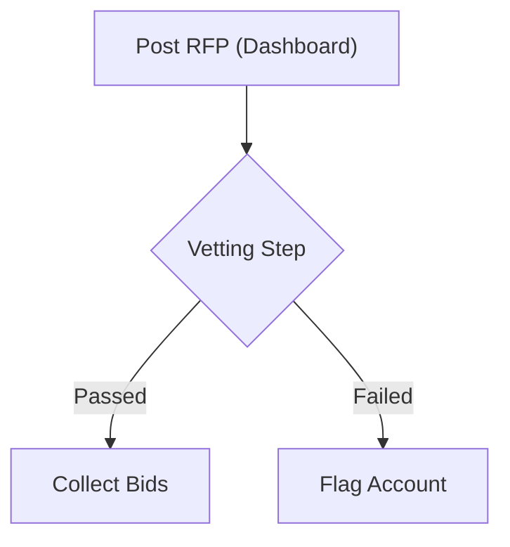

# Markdown Syntax Standards

This document establishes the Markdown formatting rules, heading hierarchies, alert formats, and code/block representation conventions across the DASP Digital workspace.

---

## 🏗️ Heading Hierarchies

To ensure documents are clean and easily parsed by LLM systems:
- **H1 (`#`)**: Exactly one H1 per page, acting as the document title.
- **H2 (`##`)**: Major content categories or sections.
- **H3 (`###`)**: Subsections inside H2 containers.
- **H4 (`####`)**: Detailed item groupings or specific specifications.

---

## 🎨 Visual Callouts (GitHub Alerts)

Use alerts to call out important concepts, warnings, or tips. Do not stack them consecutively.

```text
> [!NOTE]
> Used for general tips, context, or helpful pointers.

> [!IMPORTANT]
> Used for critical criteria that must be followed.

> [!WARNING]
> Used for caution, operational exceptions, or quality risks.
```

---

## 📊 Mermaid.js Flowchart Standards

All process representations must use Mermaid blocks with the following rules:
- Quote node labels containing parentheses, commas, or special characters.
- Maintain a clean direction (`TD` for top-to-bottom, `LR` for left-to-right).

### Flowchart Example


---

## 🔗 Absolute File Linking Rules

When linking to files within the workspace:
1. Use the absolute file link syntax with the `file:///` protocol and forward slashes.
2. Do not wrap file links in backticks.
   - *Correct*: [DASP-STYLE-Writing-Mechanics-v1.0.md](file:///D:/company/products/dnyanmitra-knowledge-center/content-standards/22-Style-Guide/DASP-STYLE-Writing-Mechanics-v1.0.md)
   - *Incorrect*: [`DASP-STYLE-Writing-Mechanics-v1.0.md`](file:///D:/company/products/dnyanmitra-knowledge-center/content-standards/22-Style-Guide/DASP-STYLE-Writing-Mechanics-v1.0.md)
