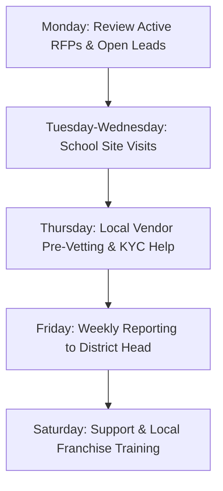

# Taluka Head Role Guide

This document defines the duties, key performance indicators (KPIs), onboarding processes, and regional support standards for **DnyanMitra Taluka Heads** (regional coordinators).

---

## 🎯 Role Objective

The Taluka Head acts as the primary field coordinator for DnyanMitra at the sub-district (Taluka) level. Their objective is to expand the platform's footprint by onboarding schools and local vendors, and to resolve regional logistical friction points.

---

## 🛠️ Key Responsibilities

1. **School Onboarding**: Visit trust offices and school principals to explain the digital bidding portal and secure platform registration.
2. **Vendor Acquisition**: Source, pre-vet, and onboard local school suppliers (furniture makers, laboratory suppliers, uniform vendors).
3. **KYC Verification Assist**: Guide local vendors through submitting tax and registration details via the vendor panel.
4. **Resolution Coordination**: Facilitate communication between school buyers and vendors during dispute resolutions or delivery delays.

---

## 📈 Key Performance Indicators (KPIs)

Regional performance is evaluated quarterly based on the following matrix:

| Metric | Target | Verification Method |
| :--- | :--- | :--- |
| **Active Schools Onboarded** | 10 per quarter | Registered profiles with posted RFPs |
| **Pre-Vetted Vendors Added** | 5 per quarter | KYC verified vendor accounts |
| **Onboarding SLA** | < 5 days | Time from registration draft to verified status |
| **Dispute Resolution Speed** | < 48 hours | Helpdesk ticket logs |

---

## 🔄 Weekly Operational Routine

---

## 🛡️ Critical Field Rules

> [!IMPORTANT]
> Taluka Heads must never collect cash, check, or online payments directly from schools or vendors. All financial transactions (e.g., service charges, subscription renewals) must be processed through the secure DnyanMitra gateway.

> [!WARNING]
> Do not approve a vendor's local shop verification without a physical site visit or a video verification showing manufacturing or stock capabilities.
