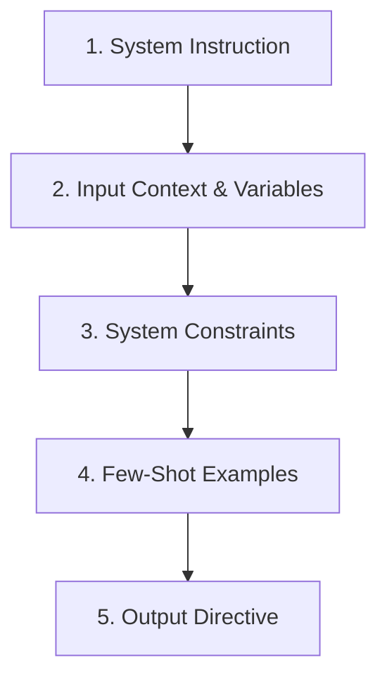

# AI Prompt Engineering Framework

This document outlines the standard prompt design rules required for all generative AI features, agent bots, and background processors across DASP Digital platforms.

---

## 🏗️ The SIC-FS Prompt Structure

To ensure deterministic, high-quality, and structurally consistent outputs from Large Language Models (LLMs), all prompts must be structured using the System-Input-Constraints-Few-Shot (**SIC-FS**) model:

### 1. System Instruction (Identity & Role)
- Define the persona, background knowledge, and core business objective of the agent.
- *Example*: *"You are the DnyanMitra-Support-Agent, an expert in resolving school billing discrepancies..."*

### 2. Input Context & Variables
- Supply database attributes or user queries using strict bracket separators.
- Use `{{variable_name}}` formatting for dynamic fields.

### 3. System Constraints (Hard Limits)
- Enforce spelling conventions (e.g. Indian/UK English).
- Ban specific words (e.g. hype words like *revolutionary, groundbreaking*).
- Define output boundaries (e.g. *"Only reply with a valid JSON block"*).

### 4. Few-Shot Examples
- Include at least two input-output mapping pairs to lock in the formatting pattern.

### 5. Output Directive
- Set the exact first character or token the model must write to prevent introductory chatter.
- *Example*: *"Start your response directly with the H1 header. Do not write introductory preambles."*
