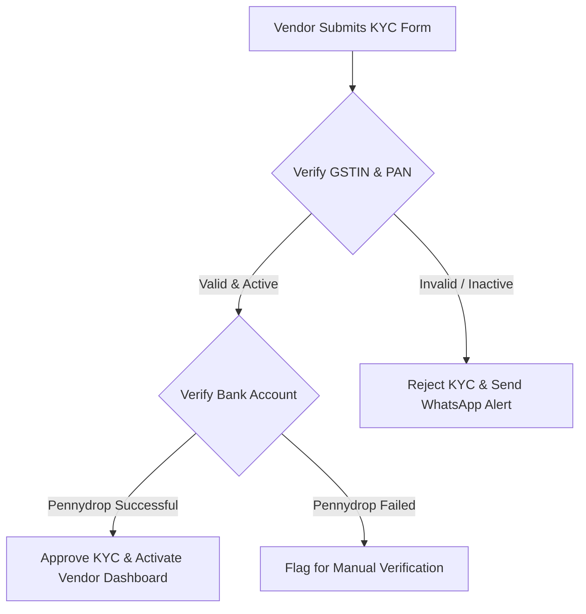

# Vendor KYC Verification Procedure

This Standard Operating Procedure (SOP) defines the operational steps required to verify a vendor's registration profile before granting active bidding permissions.

---

## 🎯 Objective & Scope

- **Objective**: Standardise verification of vendor tax, bank, and physical credentials to prevent platform fraud.
- **Scope**: Appyling to all newly registered vendor accounts within the DnyanMitra B2B marketplace.
- **Assigned Operator**: Operations Verification Clerk (approval requires Senior Auditor sign-off).

---

## 🔄 Verification Workflow

---

## 📋 Detailed Execution Steps

### Step 1: GSTIN and PAN Authentication
1. Copy the vendor's 15-digit GSTIN number from their profile details.
2. Log into the official Government GST Portal (`gst.gov.in`) or use our integrated API tool.
3. Verify that the GSTIN status is **Active** and the registered trade name matches the business name submitted on DnyanMitra.
4. Verify that the PAN card matches the first 10 characters of the GSTIN (excluding the first two state code digits).

### Step 2: Bank Account Verification
1. Access the bank details uploaded by the vendor (bank name, account number, IFSC).
2. Trigger the automated **Pennydrop Verification** tool inside the admin panel.
3. Confirm that the beneficiary name returned by the bank matches the trade name verified in Step 1.

---

## ⚠️ Exception Handling & Escalations

- **Pennydrop Name Mismatch**: If the pennydrop verification returns a personal name instead of the corporate name (e.g. sole proprietorship name), set the account status to **Pending - Manual Review**. Send a ticket to the Senior Auditor.
- **Filing Delays**: If the GSTIN search shows tax filing status as *suspended* or *defaulter*, do not approve the profile. Reject the submission and send the vendor an automated system notification stating the reason.
