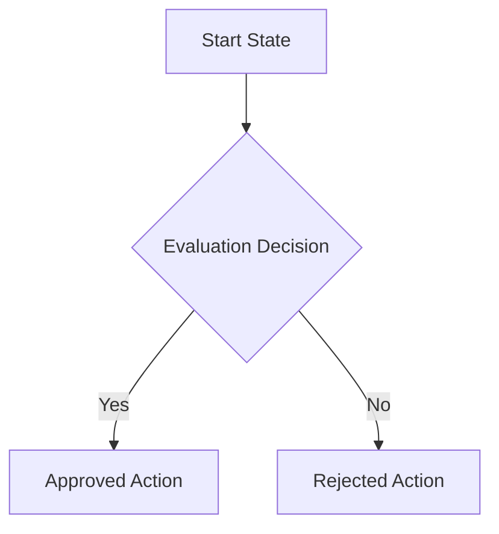

# {{Document Title}}

> [!NOTE]
> Provide a brief, high-level summary of this document's purpose, target audience, and main goals in this section.

---

## 🎯 Objectives

A clear, bulleted list detailing what this document achieves:
- Objective 1
- Objective 2
- Objective 3

---

## 🛠️ Main Content Section

### Sub-section A
Provide details here. If referencing paths or system variables, wrap them in backticks: `DnyanMitra` or `GSTIN_NUMBER`.

### Sub-section B (Table Example)
If presenting structured data, use this table format:

| Parameter / Feature | Requirement | Notes |
| :--- | :--- | :--- |
| Item Name | Value Description | Metric units preferred |
| Item Code | Alphanumeric string | Under 16 characters |

---

## 🔄 Workflow or Process Representation

Include a Mermaid block if documenting a sequence of actions or state transitions:

---

## 🛡️ Compliance & Safety Guardrails

> [!IMPORTANT]
> Detail any regulatory, quality, or compliance constraints here.

> [!WARNING]
> Highlight critical exception states or security risks in this block.
