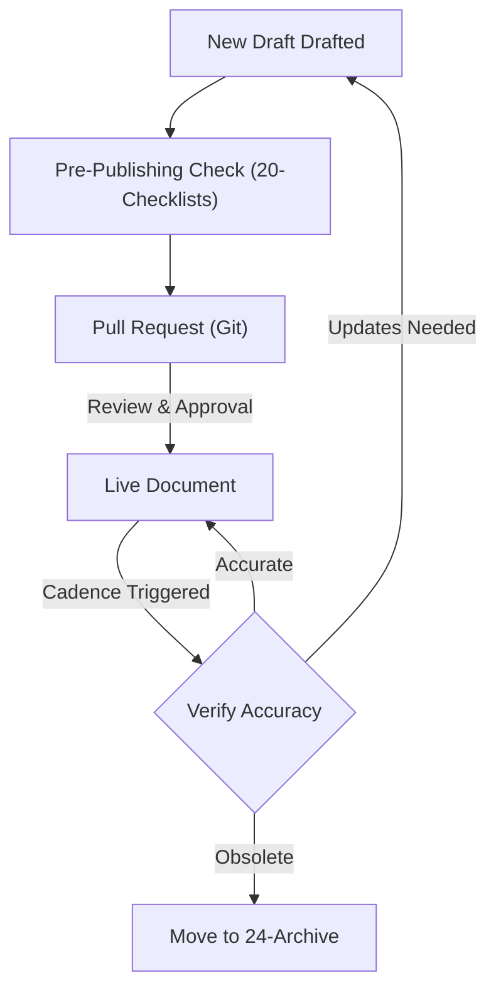

# Content Lifecycle and Governance Policy

This document defines the review frequencies, ownership mappings, and pull request approval workflows for DASP Digital content.

---

## 👥 Ownership & Review Frequency Matrix

Every directory and standard file must have an assigned business owner listed in its YAML block, responsible for keeping the documentation current.

| Directory Name | Business Owner Role | Review Cadence |
| :--- | :--- | :--- |
| **01-Brand** & **06-Marketing** | Head of Marketing | Bi-Annually |
| **02-Presentations** & **05-Sales**| Sales Director | Quarterly |
| **03-Documentation** & **22-Style-Guide**| Lead Tech Writer | Annually |
| **09-Procurement-Guides** & **18-SOP**| Operations Manager | Quarterly |
| **11-AI** & **16-Product-Documentation**| Lead AI Engineer | Quarterly |
| **17-Knowledge-Base** | Customer Support Lead | Monthly |

---

## 🔄 Lifecycle Workflow

---

## 🔒 Git Permissions & Approval Controls

To prevent unauthorized modification of brand or system directives:
- **Direct Commits**: Disabled on the main branch.
- **Pull Request Approvals**:
  - Code and system standards files (e.g. `/03-Documentation`, `/11-AI`, `/21-Governance`) require a minimum of **two approvals** including one Senior Administrator.
  - Role playbooks and SOPs (e.g. `/04-Role-Guides`, `/18-SOP`) require **one approval** from the designated folder owner.
