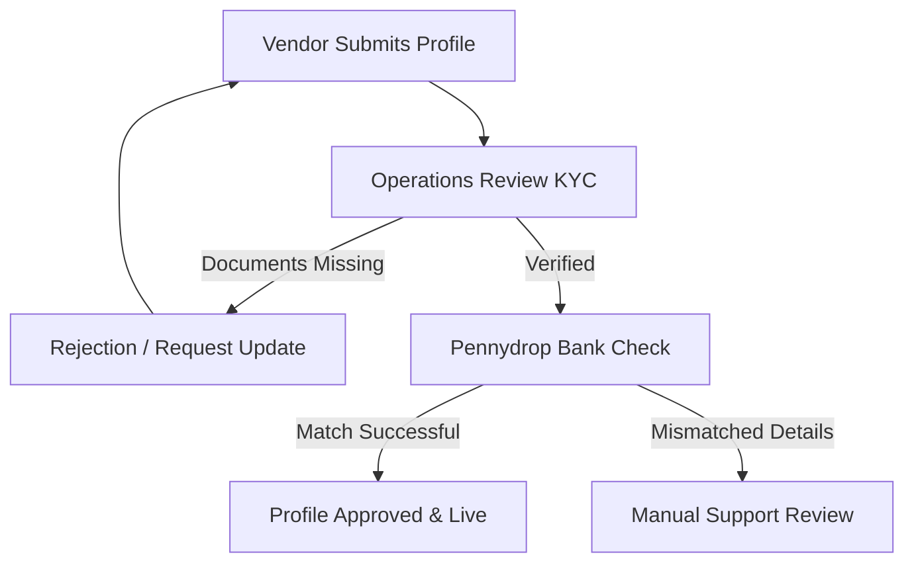

# Vendor Onboarding Registration Example

This document is a practical, compliant example demonstrating the markdown, metadata, structural, and stylistic guidelines established in the DnyanMitra Content Standards Repository.

---

## 🎯 Objectives

- Guide new suppliers through registering on the DnyanMitra platform.
- Ensure onboarding staff execute registration KYC checks consistently.
- Standardise documentation quality using standard layouts.

---

## 🛠️ Required Onboarding Documents

Before a vendor is approved to place bids, they must upload the following files through the onboarding dashboard:

| Document Name | Allowed Formats | Validation Criteria |
| :--- | :--- | :--- |
| **GSTIN Certificate** | PDF | Must show active registration and match business legal name |
| **PAN Card** | PDF / JPEG | Permanent Account Number of the business or sole proprietor |
| **Bank Mandate Form** | PDF | Cancelled cheque or passbook copy displaying IFSC |
| **MSME Certificate** | PDF | Optional (used for registration fee waivers) |

---

## 🔄 Registration & Approval Workflow

This chart represents the path a vendor profile follows from registration to final approval:

---

## 🛡️ Critical Compliance Rules

> [!IMPORTANT]
> A vendor's GSTIN must show active registration on the GST portal before approval. Do not accept cancelled or suspended GST numbers under any circumstances.

> [!WARNING]
> If a vendor bank pennydrop check returns a name mismatch (e.g., individual name instead of the registered company name), flag the account for manual verification by the Compliance Team.

---

## 🔗 Related Resources

For the governance rules, checklists, and style guidelines associated with this example, consult:
- [DASP-GOV-Content-Lifecycle-v1.0.md](../../content-standards/21-Governance/DASP-GOV-Content-Lifecycle-v1.0.md)
- [DASP-CHK-Pre-Publishing-v1.0.md](../../content-standards/20-Checklists/DASP-CHK-Pre-Publishing-v1.0.md)
- [DASP-STYLE-Writing-Mechanics-v1.0.md](../../content-standards/22-Style-Guide/DASP-STYLE-Writing-Mechanics-v1.0.md)
