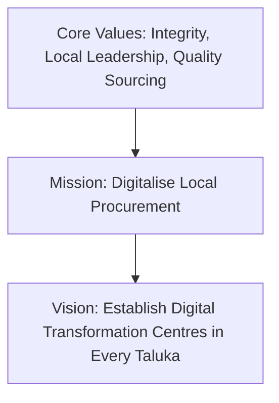

# Document Information

- **Document Name**: DASP Digital Company Profile
- **Purpose**: Introduce the corporate structure, vision, values, technology stack, and long-term roadmap of DASP Digital to prospective partners.
- **Target Audience**: Prospective Taluka Heads, franchise partners, and internal coordinators.
- **Owner**: DASP Digital Executive Board
- **Version**: 1.0.0
- **Last Updated**: 2026-07-17
- **Review Frequency**: Annually
- **Related Documents**:
  - [DM-DD-DnyanMitra-Overview-v1.0.md](DM-DD-DnyanMitra-Overview-v1.0.md)
  - [DASP-BRAND-Suite-Expansion-v1.0.md](../01-Brand/DASP-BRAND-Suite-Expansion-v1.0.md)

---

## 🏛️ Executive Summary

DASP Digital is a Pune-based technology organization specialized in building regional business-to-business (B2B) digital ecosystems. By establishing localized Digital Transformation Centres (DTCs) in every taluka of Maharashtra, DASP Digital empowers local educational institutions, sports academies, and merchant networks with enterprise-grade cloud, AI, and hardware infrastructure.

---

## 🧭 Company Overview

- **Headquarters**: Pune, Maharashtra.
- **Founded**: 2024.
- **Industry Focus**: Education Technology (EdTech), Sports Technology (SportsTech), and Hyperlocal Sourcing.
- **Core Operations**: Marketplace platform development, cloud ERP provisioning, smart classroom setup, biometric attendance monitoring, and network consulting.

---

## 🌟 Vision, Mission, and Values



### Vision
To become India's primary infrastructure provider for regional digital transformation, establishing a sustainable, technology-driven ecosystem in every district.

### Mission
To bridge the technology gap for schools and sports facilities outside Tier-1 cities by creating pre-vetted, high-quality, B2B procurement networks.

### Core Values
1. **Local Leadership**: Enabling local entrepreneurs (Taluka Heads) to drive change in their native regions.
2. **Absolute Transparency**: Disclosing pricing models, margin breakdowns, and audit reports to all stakeholders.
3. **Operational Quality**: Eliminating middle-tier distribution layers to offer best-in-class pricing for schools and institutions.

---

## 🌐 Strategic Focus Areas: Why EdTech, SportsTech & Data?

DASP Digital focuses on three pillars that represent massive unorganized procurement markets:

1. **Why Education?**
   School administrators spend significant administrative time dealing with fragmented software vendors, local stationers, and uncertified furniture suppliers. DASP Digital aggregates these under one panel (DnyanMitra).
2. **Why Sports?**
   Physical education and athletics lack structured infrastructure in semi-urban and rural areas. We bridge this with KridaMitra, coordinating training facilities, sports gear procurement, and event scheduling.
3. **Why Data?**
   By capturing local institution sizes, student demographics, and vendor capabilities, DASP Digital optimizes supply chains, prevents inventory waste, and ensures accurate delivery.

---

## 💻 Tech Stack & Product Architecture

DASP Digital platforms are built using a modern, scalable technology stack:

- **Frontend**: React.js, TailwindCSS (for high performance and responsiveness).
- **Backend Services**: Node.js microservices with Python-based AI recommendation engines.
- **Database**: PostgreSQL (Structured transaction logs) and Redis (Caching).
- **Cloud Infrastructure**: Secure AWS hosting with geographic clustering within India.
- **AI Integration**: Custom models for institutional excellence indexing, automated grading, and smart routing of marketplace orders.

---

## 📊 Organizational Structure

DASP Digital runs a flat regional network structure to maximize response speed:

```text
DASP Digital Executive Board (Pune HQ)
       └── Division Heads (Regional Divisions)
              └── District Heads (District Level)
                     └── Taluka Heads (DTC Leaders at Taluka Level)
                            └── Field Sales Executives (FSEs)
```

---

## 🗺️ 5-Year Future Roadmap

- **Year 1**: Consolidate DnyanMitra and KridaMitra operations in Western Maharashtra. Establish 50 active Taluka DTCs.
- **Year 2**: Expand DTC network to Vidarbha and Marathwada regions. Launch KrushiMitra beta for agricultural marketplace sourcing.
- **Year 3**: Deploy localized AI analytics dashboards for institutional benchmarking. Launch ZilaValley pilot for local municipality procurement.
- **Year 4–5**: Form national school network partnerships and expand operations to neighboring states (Karnataka, Gujarat, Goa).

---

## 🏁 Review Checklist

- [ ] Ensure all regional contact points are correct.
- [ ] Confirm company roadmap years match board decisions.
- [ ] Verify that tech stack updates are aligned with the development team.
