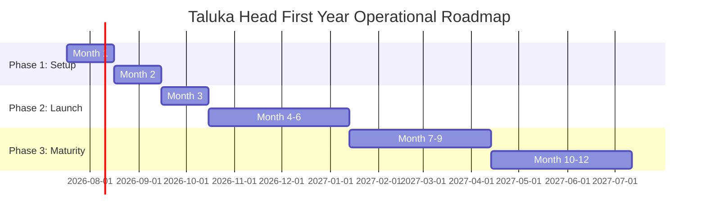

# Document Information

- **Document Name**: DnyanMitra 12-Month Business Plan
- **Purpose**: Outline the operational milestones, recruitment timelines, and monthly target expectation patterns for the first year of DTC operations.
- **Target Audience**: Prospective Taluka Heads, District Heads, and regional coaches.
- **Owner**: Operations Director
- **Version**: 1.0.0
- **Last Updated**: 2026-07-17
- **Review Frequency**: Semi-annually
- **Related Documents**:
  - [DM-DD-Revenue-Sharing-Model-v1.0.md](DM-DD-Revenue-Sharing-Model-v1.0.md)
  - [DM-DD-Sales-Process-v1.0.md](DM-DD-Sales-Process-v1.0.md)

---

## 🏛️ Executive Summary

This document establishes a practical monthly roadmap for a newly appointed Taluka Head. Rather than imposing high sales quotas immediately, DnyanMitra focuses on building local infrastructure first: training, territory audits, vendor onboarding, and team hiring, leading into structured marketplace revenue.

---

## 📅 First Year Month-by-Month Roadmap

### Month 1: Onboarding, Training & Infrastructure Mapping
- **Action Focus**: Complete administrator training on DASP CRM portals and marketplace consoles. Set up the local DTC workspace.
- **Deliverables**: Map 100% of local schools and coaching centres. Compile list of top 15 local IT/stationery vendors.
- **KPI Check**: DTC setup signed off by District Head.

### Month 2: Recruitment & Tech Audits
- **Action Focus**: Recruit and onboard one Field Sales Executive (FSE). Begin physical visits.
- **Deliverables**: Complete Institutional Excellence surveys for the first 20 target schools.
- **KPI Check**: FSE hired, mapped target school routes.

### Month 3: First Sales & Transactions
- **Action Focus**: Deploy DnyanMitra school ERP dashboards to early adopter institutions.
- **Deliverables**: Onboard first 5 local vendors to the B2B marketplace. Close first 3 ERP annual licenses.
- **KPI Check**: Total transaction value processed > ₹30,000.

### Month 4–6: smart Classrooms & Bulk Sourcing
- **Action Focus**: Focus on high-value smart board installations and bulk classroom uniform/book orders.
- **Deliverables**: Deploy at least 5 Smart Classrooms. Onboard 10 additional vendors.
- **KPI Check**: Cumulative sales value > ₹2,50,000.

### Month 7–9: Advanced AI & Safety Projects
- **Action Focus**: Pitch safety upgrades (biometric gateways, school bus GPS tracking) and AI-assisted grading modules.
- **Deliverables**: Conduct 15 product demonstrations targeting school management boards.
- **KPI Check**: Resolve 100% of customer support tickets within SLA.

### Month 10–12: AMCs & Sourcing Renewals
- **Action Focus**: Transition early hardware accounts to Annual Maintenance Contracts (AMCs). Prepare for upcoming academic year renewals.
- **Deliverables**: Sign up 80% of eligible schools to AMC packages. Begin mapping requirements for uniform supplies for the next school year.
- **KPI Check**: Active recurring contract revenue baseline established.

---

## 🏁 Review Checklist

- [ ] Confirm that training schedules match District Head availability.
- [ ] Verify that monthly growth milestones align with the commission splits.
- [ ] Check relative link integrity across the standards folder.
