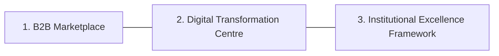

# Document Information

- **Document Name**: DnyanMitra Platform Overview
- **Purpose**: Detail the DnyanMitra marketplace model, Digital Transformation Centre concept, stakeholder matrix, and platform roadmaps.
- **Target Audience**: Prospective Taluka Heads, regional managers, and vendor coordinators.
- **Owner**: DnyanMitra Product Lead
- **Version**: 1.0.0
- **Last Updated**: 2026-07-17
- **Review Frequency**: Semi-annually
- **Related Documents**:
  - [DASP-DD-Company-Profile-v1.0.md](DASP-DD-Company-Profile-v1.0.md)
  - [DM-DD-Revenue-Sharing-Model-v1.0.md](DM-DD-Revenue-Sharing-Model-v1.0.md)

---

## 🏛️ Executive Summary

DnyanMitra is an integrated Business-to-Business (B2B) marketplace and school management platform. It streamlines institutional procurement by connecting educational institutions (schools, colleges, coaching classes) directly with verified manufacturers and digital service providers. The physical link is maintained locally through the **Digital Transformation Centre (DTC)**, managed by the Taluka Head.

---

## 💡 Core Pillars of DnyanMitra

DnyanMitra operates on three distinct pillars:

### 1. The B2B Marketplace
A specialized portal where schools can procure hardware (smart boards, biometric devices, CCTV), software (ERP licenses, AI classroom tools), uniform kits, laboratory equipment, and maintenance services. All vendors on the platform undergo rigorous KYC validation.

### 2. The Digital Transformation Centre (DTC)
The local office situated in the taluka (managed by the Taluka Head) that serves as a physical support node. It holds demo equipment (e.g. smart boards, GPS bus trackers) so school administrators can touch and test products before making large procurement decisions.

### 3. The Institutional Excellence (IX) Framework
An AI-driven auditing model that evaluates a school's digital readiness, administrative overhead, safety standards (CCTV, bus tracking), and academic tools. The resulting scorecard gives trustees a step-by-step roadmap for upgrading their institution.

---

## 🤝 Stakeholder Matrix & Value Propositions

How DnyanMitra creates value for each participant in the ecosystem:

| Stakeholder | Key Role | Primary Value Proposition |
| :--- | :--- | :--- |
| **Educational Institutions** | Buyers of products & service packages | Access to verified vendors, transparent bulk pricing, and local support. |
| **Local Vendors** | Suppliers of hardware, uniforms, maintenance | Direct channel to regional institutional buyers with zero intermediary costs. |
| **Taluka Heads** | DTC Managers & Relationship owners | Recurring commission share across all software, hardware, and marketplace sales. |
| **District/Division Heads** | Quality auditors & Regional mentors | Overriding commission share and regional ecosystem performance targets. |
| **Students & Parents** | End-users of software and school assets | Improved safety (biometrics, bus tracking) and advanced AI classroom tools. |
| **Teachers** | Platform operators | Reduced administrative workload via automated grading and cloud ERP trackers. |

---

## 🤖 AI for Education Integrations

DnyanMitra integrates custom AI features directly into school workflows:
- **Automated Grading Assistant**: Scans physical answer sheet uploads and benchmarks scores.
- **Smart Sourcing Agent**: Matches a school's procurement request with local vendor bids to get the lowest compliant price.
- **Predictive Maintenance**: Alerts school managers when smart boards or CCTV networks in their taluka are approaching their AMC expiration dates.

---

## 🏁 Review Checklist

- [ ] Verify that all stakeholder roles are described without marketing jargon.
- [ ] Check that the relative links to other due diligence files are verified.
- [ ] Confirm the AI integrations match current developer milestones.
