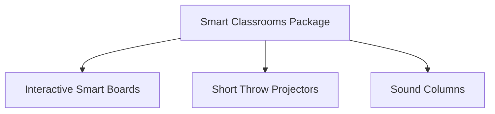

# Document Information

- **Document Name**: DnyanMitra Product Catalogue
- **Purpose**: Outline the feature sets, target markets, pricing models, and cross-sell options for software and hardware products.
- **Target Audience**: Prospective Taluka Heads, District Heads, and Sales Executives.
- **Owner**: Product Marketing Manager
- **Version**: 1.0.0
- **Last Updated**: 2026-07-17
- **Review Frequency**: Semi-annually
- **Related Documents**:
  - [DM-DD-Revenue-Sharing-Model-v1.0.md](DM-DD-Revenue-Sharing-Model-v1.0.md)
  - [DM-DD-Service-Portfolio-v1.0.md](DM-DD-Service-Portfolio-v1.0.md)

---

## 🏛️ Executive Summary

This catalogue details the DnyanMitra platform software applications and pre-vetted classroom hardware packages. Every product sheet includes a definition of the target user, price range, and potential cross-sell options to help Taluka Heads maximize transaction size.

---

## 💻 1. Software Solutions

### School & College ERP Systems
- **The Problem**: Semi-urban and rural schools spend excessive hours manually tracking student attendance, compiling fee collections, and preparing exams.
- **The Solution**: An integrated cloud ERP that manages fees, schedules classes, and publishes reports on one dashboard.
- **Key Features**:
  - Offline-first attendance logging.
  - WhatsApp integration for automatic parent alerts (fee receipts, alerts).
  - Standardized mark sheets generation.
- **Target Customer**: School trustees, principals, and district board schools.
- **Pricing Model**: Annual subscription (₹150 to ₹250 per student per year).
- **Cross-sell**: Biometric integration for teacher attendance, school bus GPS tracking.

### DnyanMitra B2B Marketplace Panel
- **The Problem**: Sourcing uniforms, books, and science labs involves multiple non-transparent intermediaries, leading to high markups.
- **The Solution**: A direct panel linking school buyers with pre-vetted manufacturers.
- **Target Customer**: School procurement heads and board directors.
- **Pricing Model**: Transaction-based (flat commission margin on bulk orders).
- **Cross-sell**: Annual laboratory maintenance contracts, smart board fittings.

---

## 🔌 2. Hardware Solutions

### Interactive Smart Boards
- **The Problem**: Traditional chalkboards limit interactive learning and student participation.
- **The Solution**: Full HD, infrared interactive smart board assemblies bundled with standard digital teaching curricula.
- **Key Features**:
  - Anti-glare tempered glass screen.
  - Multi-touch inputs (stylus/finger).
  - Preloaded CBSE and State Board science/math content libraries.
- **Target Customer**: Private schools, colleges, and coaching classes.
- **Pricing Model**: One-time purchase (₹95,000 to ₹1,40,000 per classroom, depending on screen size).
- **Cross-sell**: Classroom audio setups, annual software updates, UPS backup batteries.

### Biometric Attendance & Security Systems
- **The Problem**: Proxy attendance, manual register manipulation, and lack of real-time parent check-in notifications.
- **The Solution**: Cloud-connected fingerprint and facial recognition scanners linked to the DnyanMitra ERP database.
- **Target Customer**: Mid-to-large-size colleges, ITIs, and boarding schools.
- **Pricing Model**: One-time hardware purchase (₹12,000 to ₹25,000 per terminal) + annual SaaS link license (₹3,000 per terminal).
- **Cross-sell**: CCTV security cameras, automated SMS gateways.

---

## 🏃 3. Sports & Academy Solutions (KridaMitra)

### KridaMitra Booking & PE Platform
- **The Problem**: Local playgrounds, PE equipment sourcing, and sports training suffer from lack of access to quality equipment.
- **The Solution**: Sports management portal offering equipment bookings, coach scheduling, and physical testing scoring tools.
- **Target Customer**: Sports coaches, school PE directors, and private academies.
- **Pricing Model**: Annual subscription + hardware kit bulk sourcing commission.

---

## 🏁 Review Checklist

- [ ] Verify that all price points are consistent with current manufacturer listings.
- [ ] Confirm target customer profiles are aligned with semi-urban demographics.
- [ ] Check relative link integrity across the standards folder.
