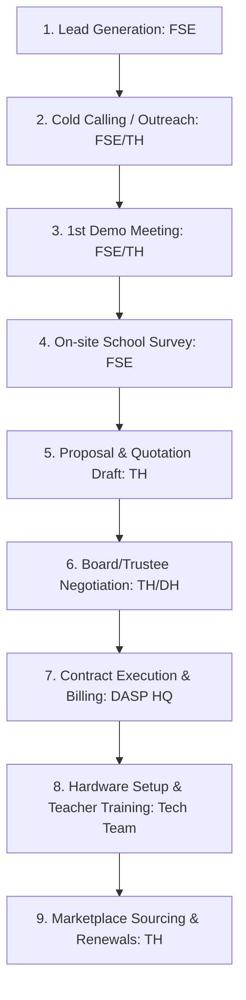

# Document Information

- **Document Name**: DnyanMitra Sales Process
- **Purpose**: Document the pipeline progression stages, sales workflow, and allocation of responsibilities between FSEs, Taluka Heads, and District Heads.
- **Target Audience**: Prospective Taluka Heads, FSE recruits, and sales trainers.
- **Owner**: Sales Director
- **Version**: 1.0.0
- **Last Updated**: 2026-07-17
- **Review Frequency**: Annually
- **Related Documents**:
  - [DM-DD-Taluka-Head-Role-Guide-v1.0.md](DM-DD-Taluka-Head-Role-Guide-v1.0.md)
  - [DM-DD-12-Month-Business-Plan-v1.0.md](DM-DD-12-Month-Business-Plan-v1.0.md)

---

## 🏛️ Executive Summary

The DnyanMitra sales model relies on a structured sequence that shifts school administration from initial curiosity to active marketplace transactions. By separating field activities (FSE role) from relationship negotiation (Taluka Head role) and governance overrides (District Head role), DnyanMitra ensures high conversion rates with zero pressure.

---

## 🔄 Sales Pipeline Workflow

This flowchart maps the typical progression of an institutional deal from lead to renewal:

---

## 🤝 Division of Responsibilities Matrix

To prevent overlapping efforts, responsibilities are allocated strictly across roles:

| Sales Stage | Field Sales Executive (FSE) | Taluka Head (TH) | District Head (DH) |
| :--- | :--- | :--- | :--- |
| **Lead Generation** | Identifies local schools, maps names of principals, logs details in CRM. | Approves local list of school targets for the week. | Provides database extracts from district registers. |
| **Outreach** | Makes initial phone calls using standard script. | Handles incoming Q&A queries and schedules Zoom calls. | Oversees regional pipeline targets. |
| **On-site Audits** | Visits school physically to map smart boards, computers, and CCTV. | Resolves specific hardware compatibility concerns. | Approves audit reports before proposal submission. |
| **Proposal & Quote**| Assists with data mapping. | Drafts pricing plans and builds hardware bills of quantities. | Approves bulk discounts or custom margin concessions. |
| **Trustee Meeting** | Provides logistics support. | Presents the business proposal and handles trust negotiations. | Joins high-value negotiations (above ₹3 Lakh). |
| **Customer Success**| Checks smart board usage weekly. | Reviews quarterly AMC tickets and coordinates local support. | Conducts annual quality reviews. |

---

## 🏁 Review Checklist

- [ ] Verify that the division of responsibilities matches current job contracts.
- [ ] Confirm that CRM pipeline stages in the flowchart correspond with the dashboard software configuration.
- [ ] Check relative link integrity across the standards folder.
