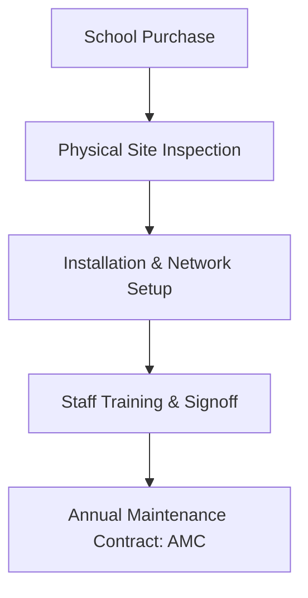

# Document Information

- **Document Name**: DnyanMitra Service Portfolio
- **Purpose**: Detail the post-sales installation, audit consulting, school training, and annual maintenance contract services offered under the DTC model.
- **Target Audience**: Prospective Taluka Heads, technical leads, and operations personnel.
- **Owner**: Operations Director
- **Version**: 1.0.0
- **Last Updated**: 2026-07-17
- **Review Frequency**: Semi-annually
- **Related Documents**:
  - [DM-DD-Product-Catalogue-v1.0.md](DM-DD-Product-Catalogue-v1.0.md)
  - [DM-DD-Sales-Process-v1.0.md](DM-DD-Sales-Process-v1.0.md)

---

## 🏛️ Executive Summary

Beside software and hardware sales, DnyanMitra Digital Transformation Centres offer specialized implementation and consulting services. These generate recurring revenue streams through Annual Maintenance Contracts (AMCs) and onboarding packages, securing customer loyalty.

---

## 🛠️ 1. Technical Implementation & Support

### Smart Classroom Installation
- **Service Scope**: Mount and wire interactive smart boards, align projectors, install audio columns, and calibrate touch sensors.
- **Delivery SLA**: Installation completed within 5 business days of hardware delivery.
- **Pricing Model**: Standard installation charge (₹4,000 per classroom, included in initial invoice).

### Annual Maintenance Contracts (AMC)
- **Service Scope**: Quarterly preventive maintenance visits, free hardware diagnostics, and priority replacement part logistics.
- **Delivery SLA**: Dispatch local field engineer within 24 hours of ticket logging.
- **Pricing Model**: Annual fee (10% to 15% of the total hardware purchase value per year).
- **Commission Split**: 12% direct payout to the Taluka Head DTC.

---

## 📊 2. Consulting & Audit Services

### Institutional Excellence (IX) Audits
- **Service Scope**: On-site tech auditing by the Taluka Head and FSE checking:
  - Safety (CCTV deadzones, fire safety compliance status).
  - Infrastructure (computer-to-student ratios, internet bandwidth limits).
  - Administration (hours spent manually processing fee receipts).
- **Deliverable**: An AI-generated Institutional Benchmark Report with detailed upgrade recommendations.
- **Pricing Model**: Free for the first audit (used as a sales hook); ₹5,000 for annual follow-up audits.

### AI Readiness Consulting
- **Service Scope**: Evaluation of faculty familiarity with digital tools, designing teacher-training schedules, and proposing automated grading setups.
- **Pricing Model**: Project-based fee (starting at ₹15,000 per school).

---

## 🎓 3. Training & Professional Development

### Faculty ERP & LMS Workshops
- **Service Scope**: Hand-on training for teachers on uploading grades, mapping timetables, tracking student leaves, and sending WhatsApp notifications.
- **Delivery SLA**: 2-day on-site training sessions (4 hours per day).
- **Pricing Model**: Flat training fee (₹8,000 per workshop package).

---

## 🏁 Review Checklist

- [ ] Verify that service installation pricing covers local technician costs.
- [ ] Confirm SLA response windows align with regional transport speeds.
- [ ] Check relative link integrity across the standards folder.
