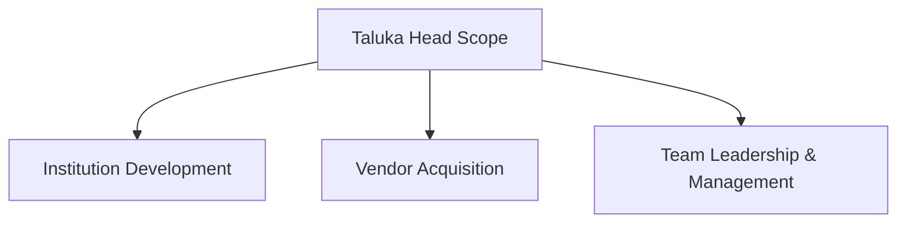

# Document Information

- **Document Name**: DnyanMitra Taluka Head Role Guide
- **Purpose**: Outline the operational duties, weekly cadence, KPIs, and code of conduct for regional Taluka Heads.
- **Target Audience**: Prospective Taluka Heads, District Heads, and onboarding coaches.
- **Owner**: Operations Director
- **Version**: 1.0.0
- **Last Updated**: 2026-07-17
- **Review Frequency**: Annually
- **Related Documents**:
  - [DASP-DD-Company-Profile-v1.0.md](DASP-DD-Company-Profile-v1.0.md)
  - [DM-ROLE-Taluka-Head-v1.0.md](../04-Role-Guides/DM-ROLE-Taluka-Head-v1.0.md)

---

## 🏛️ Executive Summary

The Taluka Head acts as DASP Digital's primary regional entrepreneur. Rather than working as a standard sales executive, the Taluka Head builds a **Digital Transformation Centre (DTC)**, recruiting field personnel, establishing vendor networks, and serving as the direct technology partner for schools and colleges across the taluka.

---

## 🎯 Mission & Leadership Scope

The mission of the Taluka Head is to drive digital inclusion in their territory. They lead local educational transformation by helping institutions audit their technology gaps, procure pre-vetted classroom equipment, and streamline operations.

---

## 💼 Core Responsibilities

### 1. Institution Development
- Audit local schools using the DnyanMitra Institutional Excellence frameworks.
- Schedule smart board, CCTV, and ERP dashboard demonstrations.
- Coordinate proposal drafts and negotiate supply contracts.

### 2. Local Vendor Acquisition
- Onboard local IT dealers, service contractors, stationers, and uniform providers onto the DnyanMitra B2B Marketplace.
- Verify vendor business credentials (PAN, GSTIN, and physical location).

### 3. Team Leadership
- Recruit, train, and manage at least one Field Sales Executive (FSE) who covers daily school visits.
- Set weekly visit logs and monitor CRM progress.

---

## 📅 Structured Work Cadence

To ensure business growth, Taluka Heads must establish a consistent operational cadence:

### Daily Activities
- Conduct morning team briefing with the Field Sales Executive (FSE).
- Review pending CRM leads and assign visit routes.
- Execute 1–2 physical visits to high-priority schools or colleges.
- Log daily transaction requests and support tickets.

### Weekly Activities
- Audit FSE school visit logs (minimum 15 school visits per week).
- Onboard 2-3 new local vendors to the marketplace.
- Conduct a weekly progress review call with the District Head.

### Monthly Activities
- Calculate revenue sharing commissions and target progress.
- Review regional marketing campaign ROI (banners, local newspaper inserts).
- Audit outstanding AMC agreements and coordinate technician dispatches.

---

## 📈 Key Performance Indicators (KPIs)

Taluka Heads are evaluated on four key parameters:

1. **Active Institution Penetration (30%)**: Number of schools/colleges utilizing DnyanMitra ERP or hardware.
2. **Onboarded Vendor Quality (20%)**: Number of local vendors uploading product catalogues and resolving delivery tickets on time.
3. **FSE Productivity (30%)**: Visits-to-demonstration conversion rate.
4. **Platform Transaction Volume (20%)**: Cumulative B2B marketplace sales value.

---

## 🛑 Code of Conduct & Integrity Rules

- **Zero-Tolerance Kickbacks**: Taluka Heads must never demand commissions or gifts from local vendors. All marketplace transactions must follow transparent DnyanMitra billing.
- **Data Protection**: Client school databases, student attendance logs, and fee registers must remain confidential.
- **Accurate KYC**: Physical site visits are mandatory for all vendor onboardings; virtual-only validation is strictly prohibited.

---

## 🏁 Review Checklist

- [ ] Confirm that KPIs match the operational contract parameters.
- [ ] Verify that the daily cadence lists are practical and realistic.
- [ ] Check relative link integrity across the standards folder.
