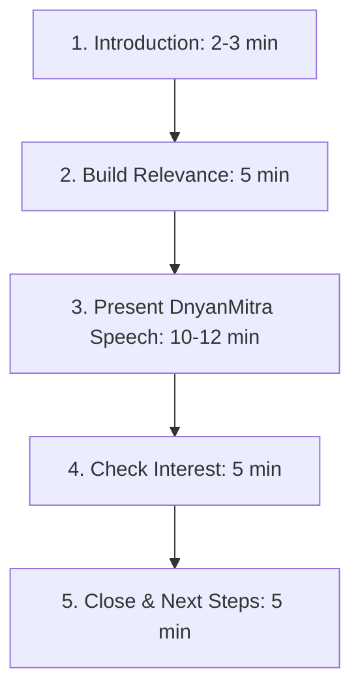

# Taluka Head First Demo and Engagement Speech Guide

This document outlines the strategy, conversational flow, and recommended structure for the first meeting speech delivered to potential Taluka Heads (targeting computer training institute owners).

---

## 🧭 Core Engagement Strategy

> [!IMPORTANT]
> **We should not ask 15-20 questions in the first meeting.**
> Because you initiated the contact, you have not yet earned enough trust or interest. The goal of the first meeting is not to evaluate them completely—it is to create interest and determine whether there is mutual potential.

Think of the partnership lifecycle as a multi-step progression:
- **First meeting**: "Should we continue talking?" (Speech & Introduction)
- **Second meeting**: "Are you the right Taluka Head?" (Detailed Evaluation)
- **Third meeting**: "Let's finalise the partnership." (Agreement Signing)

---

## 🔄 First Meeting Speech Structure (20-30 Minutes)

Keep the interaction light, collaborative, and conversational.

### 1. Introduction Speech (2–3 minutes)
State your intention early and keep the pressure low:
> *"Before I explain the opportunity, I'd just like to know a little about you."*

Ask only 3–4 basic questions:
- Can you tell us a little about your current business?
- How long have you been running your institute/business?
- Do you also work with schools or colleges?
- What made you accept today's meeting?

---

### 2. Build Relevance & Listen (5 minutes)
Instead of asking interrogative questions, involve them with a few opinion-based questions:
- *"In your opinion, what is the biggest challenge schools face today?"* (Pause and listen)
- *"Do you think AI will change education in the next five years?"*
- *"How are schools in your area currently buying software and equipment?"*

These questions build rapport and show that you value their industry expertise.

---

### 3. Presenting DnyanMitra (10–12 minutes)
Briefly present the core of the business model in your speech:
- **Vision**: Digitising school procurement in India.
- **Platform Suite**: DnyanMitra (Education B2B), KridaMitra (Sports & PE bookings).
- **The Role**: Regional technology leadership (Taluka Head).
- **Commercials**: The revenue model and training support provided by DASP Digital.

---

### 4. Check Interest (5 minutes)
Ask open-ended questions that lead naturally into discussion:
- Which part of this opportunity interests you the most?
- Do you think this model could work in your taluka?
- What concerns would you have before joining?

---

### 5. Closing Speech (5 minutes)
Do not ask them to join immediately. Maintain a low-pressure close:
> *"I'd like you to think about this opportunity. If you're interested, we'll schedule a second meeting where we'll discuss the business plan for your taluka, answer all your questions, and see whether we're a good fit to work together."*

---

## 💼 Second Meeting Agenda (45-60 Minutes)

Once trust is established, you can evaluate candidate suitability in detail.

- **Territory**: Regional boundaries and schools coverage.
- **Network**: Existing connections with school administrators and trustees.
- **Commitment**: Time availability and local team hiring capacity.
- **Financials**: Capital expectations, revenue projections, and business planning.

---

## 💡 Positioning Guidelines

When speaking with computer training institute owners:
- **Avoid**: *"We are recruiting Taluka Heads."*
- **Use**: *"We're expanding DASP Digital's education ecosystem in your taluka and are looking for a local technology leader to represent us."*

> [!TIP]
> Positioning candidates as **local technology leaders** rather than applicants aligns with their professional identity and makes the initial conversation feel collaborative. Once interest is established, introduce the **Taluka Head** title.
