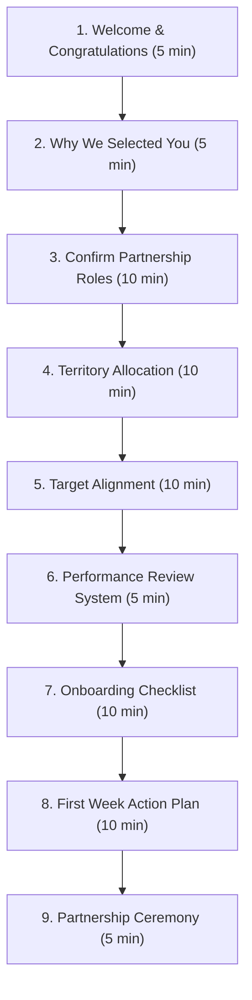

# Taluka Head Partnership Finalisation Guide

This document defines the strategy, conversational flow, agenda, targets, and internal handovers for the third meeting with potential Taluka Heads, designated as the **Partnership Finalisation & Onboarding Session**.

---

## 🧭 Meeting Mindset & Objective

The third meeting is focused on building commitment and finalizing the partnership.

> [!NOTE]
> **Mindset Hook**: The candidate should leave the third meeting thinking:  
> *"I am now the Taluka Head for my taluka, and I know exactly what I need to do from tomorrow."*

This session is designed to last **60 to 75 minutes**.

---

## 🔄 Workshop Agenda & Timeline



---

## 🗣️ Conversational Scripts & Onboarding Outline

### 1. Welcome & Congratulations (5 Minutes)
Start the meeting on an exciting and celebratory note:
> *"Congratulations! After our previous discussions and evaluation, we believe you are a good fit to represent DASP Digital as the Taluka Head for your territory. Today is not another presentation. Today we are officially starting our partnership."*

### 2. Why We Selected You (5 Minutes)
Reaffirm their strengths explicitly to build trust:
- *"You understand technology education deeply through your institute."*
- *"You maintain a solid reputation among regional school networks."*
- *"We believe you possess the leadership capacity to build and guide field sales teams."*

---

### 3. Partnership Responsibility Alignment (10 Minutes)

Confirm mutual responsibilities:

- **DASP Digital Will Provide**:
  - The secure DnyanMitra B2B marketplace platform.
  - Software licensing, cloud ERP systems, and AI modules.
  - Sourcing support and technical updates.
  - National marketing materials and coordinator CRM access.
- **Taluka Head Will Provide**:
  - Local leadership and physical verification management.
  - Active relationship building with schools and trust boards.
  - Recruitment and mentoring of local Field Sales Executives (FSEs).
  - Business growth execution across the taluka.

---

### 4. Territory Sizing & Map Allocation (10 Minutes)
Show the regional taluka map and officially allocate the territory:
> *"This entire taluka is now your exclusive business territory. All school RFPs posted here and all local vendors verified in this region fall under your Digital Transformation Centre."*

---

### 5. First-Quarter Target Alignment (10 Minutes)

Discuss and agree on realistic milestones rather than imposing them:

| Month | Target Goal | Expected Sourcing Output |
| :--- | :--- | :--- |
| **Month 1** | Team & Training Setup | Complete CRM training, recruit 1 FSE, survey 20 schools, list 15 vendors |
| **Month 2** | Demonstration Phase | Conduct 10 product demos, onboard 10 vendors, submit 15 RFPs |
| **Month 3** | Sourcing Pipelines | Close initial software/hardware deals, host 1 local school awareness event |

---

## 🛠️ Onboarding checklists

Ensure all items are marked off before concluding the meeting:

- [ ] **Partnership Agreement**: Executed and signed by both parties.
- [ ] **Identity & Tax Vetting**: PAN, bank mandate, and GSTIN (if applicable) uploaded.
- [ ] **CRM Access**: Official coordinator email and password activated.
- [ ] **Document Access**: Access granted to the product catalogues, branding kits, and sales decks.

---

## 📅 First Week Plan (10 Minutes)

Outline a clear day-by-day roadmap for their first week:

```text
Day 1: CRM & Administrative Tools Training
Day 2: Marketplace Vendor Panel Walkthrough
Day 3: Product Sourcing & Technical Features Training
Day 4: Regional School & Trust Mapping
Day 5: Local IT and Hardware Vendor Mapping
Day 6: Interviewing and Selecting the first FSE
Day 7: Weekly Performance Review Call with District Head
```

---

## 🤝 Concluding the Partnership Ceremony (5 Minutes)

End the meeting on a high note by presenting:
- Official **Appointment Letter**.
- Taluka Head **Digital ID Card** and branded email address.
- **Welcome Kit** and DASP Digital Partner Certificate.

> *"Welcome to the DnyanMitra family. We are excited to build the future of education in your taluka together!"*
