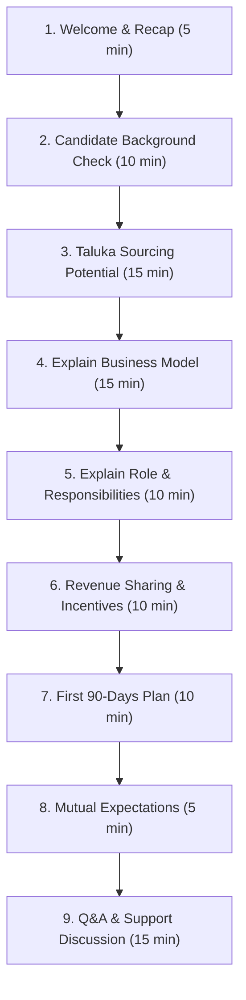
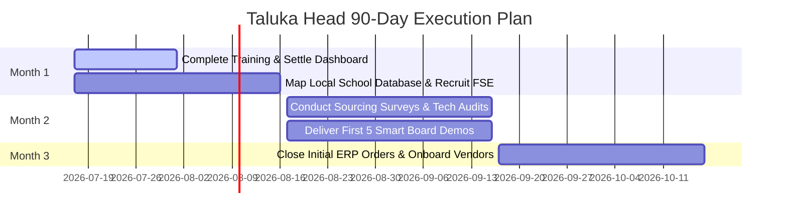

# Taluka Business Planning Workshop Guide

This document defines the strategy, conversational flow, agenda, and evaluation metrics for the second meeting with potential Taluka Heads, internally designated as the **Taluka Business Planning Workshop**.

---

## 🧭 Meeting Mindset & Objective

The second meeting is where you transition from "selling the opportunity" to co-designing a regional business partnership. 

> [!NOTE]
> **Mindset Hook**: *"Today we are not discussing a job. We are discussing whether we can build the Digital Transformation Centre for your taluka together."*

This workshop typically runs between **60 and 90 minutes**.

---

## 🔄 Workshop Agenda & Timeline

---

## 🗣️ Conversational Scripts & Prompts

### 1. Welcome & Frame (5 Minutes)
> *"Thank you for joining our planning session today.  
> In our first meeting, we introduced DnyanMitra and discussed our vision. Today, we'd like to explore how we can build this opportunity together in your taluka. This workshop is also for you to evaluate DASP Digital. Please ask any questions openly."*

### 2. Candidate Deep Dive (10 Minutes)
Ask open-ended questions targeting business, network, leadership, and motivation:
- **Business**: *"Tell us more about your current computer training institute/business. Who are your major customers today? Do you already work with local school boards?"*
- **Network**: *"Approximately how many school principals or management trustees in this taluka do you know personally? Do you have contact with local computer hardware suppliers?"*
- **Leadership**: *"Have you managed field executives or sales teams before? Have you run local recruitment?"*
- **Motivation**: *"What part of building a regional digital transformation center interests you the most?"*

---

### 3. Sourcing Potential Sizing (15 Minutes)
Present the local Taluka demographic report (e.g. total population, list of schools, colleges, ITIs, coaching centers).
Invite corrections to demonstrate local knowledge:
> *"Does this database of schools match your understanding of the taluka? Are we missing any major institutions or local vendors?"*

---

### 4. Revenue Streams & Business Model (15 Minutes)
Explain that the Taluka Head represents the entire DASP Digital platform suite. Revenue is generated from multiple recurring channels:

| Revenue Channel | Service / Product Scope |
| :--- | :--- |
| **School & College ERP** | Institutional management software subscriptions |
| **AI Solutions** | Smart classroom assets & automated grading assistants |
| **Infrastructure Setup** | Sourcing smart boards, CCTV networks, and computer lab hardware |
| **Marketplace Orders** | Flat commission share from DnyanMitra B2B vendor sales |
| **AMC Agreements** | Annual Maintenance Contracts for school computer labs |

---

### 5. Role and Scope (10 Minutes)
Clarify that this is a business development leadership role:
- Build relationship bridges with trust directors and school boards.
- Recruit and mentor local Field Sales Executives (FSEs).
- Expand the pre-vetted local vendor network.
- Maintain coordination with the District Head and DASP support teams.

---

### 6. Revenue Sharing & Commissions (10 Minutes)
Present commission metrics using clear, conservative examples:
- **Commission Rates**: Slide payouts depend on product type (e.g., higher share on software subscriptions, flat rate on hardware sourcing).
- **Guaranteed Compensation**: Detail minimum guarantee clauses (if milestones are met) during onboarding months.
- **Example Calculation**: If a Taluka Head facilitates a ₹5 Lakh lab infrastructure upgrade, the commission breakdown will be ₹35,000 (7% platform commission share).

---

### 7. 90-Day Onboarding Roadmap (10 Minutes)

---

## ⚖️ Internal Candidate Scorecard (For District Heads)

Evaluate candidates objectively using this weighted rubric:

| Assessment Area | Weight | Core Competency Checked |
| :--- | :--- | :--- |
| **Communication Skills** | 20% | Clarity, formal tone, active listening |
| **Local Education Network** | 20% | Direct access to school trustees & principals |
| **Leadership Ability** | 15% | Team building potential, FSE recruitment track record |
| **Business Mindset** | 15% | Understanding of investment, ROI, and local territory risk |
| **Technology Understanding** | 10% | Familiarity with cloud platforms, ERPs, and computer hardware |
| **Time Availability** | 10% | Ability to dedicate at least 25 hours per week |
| **Long-Term Growth Commitment**| 10% | Alignment with KridaMitra and KrushiMitra expansion plans |

---

## 📦 Post-Workshop Follow-Up Package

Within 24 hours of the workshop, email the candidate:
- **DnyanMitra Overview** & Company Profile.
- **Taluka Head Role Guide** ([DM-ROLE-Taluka-Head-v1.0.md](file:///D:/company/products/dnyanmitra-knowledge-center/content-standards/04-Role-Guides/DM-ROLE-Taluka-Head-v1.0.md)).
- **Revenue Sharing and Compensation Policy**.
- **Product Catalogue & 90-Day Action Plan**.
- **Next Steps Checklists**.
