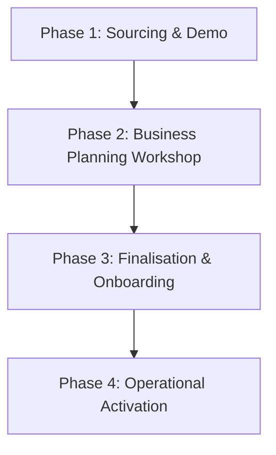

# DnyanMitra Partner Onboarding Guide

This guide details the complete end-to-end journey for onboarding new regional franchise partners and Taluka Heads into the DnyanMitra ecosystem. It outlines selection stages, administrative compliance checklists, platform tools, and early execution milestones.

---

## 🗺️ Partner Onboarding Journey

---

## 🛠️ Step-by-Step Onboarding Phases

### Phase 1: Sourcing & Initial Engagement
- **Objective**: Engage local technology and education leaders (such as computer training institute owners) and generate interest without pitching aggressively.
- **Meeting Format**: 20-30 Minute introductory dialogue.
- **Invitation Call Script**: [DM-SALES-Taluka-Head-Call-Script-v1.0.md](../sales/DM-SALES-Taluka-Head-Call-Script-v1.0.md) (Multi-lingual invitation script).
- **Reference Script**: [DM-SPCH-Taluka-Head-Demo-v1.0.md](../presentations/DM-SPCH-Taluka-Head-Demo-v1.0.md) (First meeting speech guide).
- **Core Guideline**: Do not perform detailed background evaluation in this meeting. Position candidates as regional technology partners.

### Phase 2: Business Planning Workshop
- **Objective**: Conduct a deep-dive evaluation of local networks, commercial feasibility, and revenue streams.
- **Meeting Format**: 60-90 Minute planning session.
- **Reference Script**: [DM-SPCH-Taluka-Head-Workshop-v1.0.md](../presentations/DM-SPCH-Taluka-Head-Workshop-v1.0.md) (Second meeting Planning Workshop guide).
- **Key Tasks**: Sizing territory opportunities, explaining multi-channel revenue (ERP, Smart Classrooms, AMC), and scoring the candidate on the District Head Evaluation Scorecard.

### Phase 3: Partnership Finalisation & Training
- **Objective**: Sign agreements, allocate territories, and build the day-by-day plan for the partner's first week.
- **Meeting Format**: 60-75 Minute finalisation meeting.
- **Reference Script**: [DM-SPCH-Taluka-Head-Finalisation-v1.0.md](../presentations/DM-SPCH-Taluka-Head-Finalisation-v1.0.md) (Third meeting finalisation speech guide).
- **Deliverables**: Appointment Letter presentation, official email/ID activation, and onboarding checklist confirmation.

---

## 🛡️ Strict Compliance & KYC Verification

To protect DASP Digital platform integrity, all prospective Taluka Heads must complete rigorous KYC vetting before accessing school networks:

1. **Identity & Business Verification**:
   - Submission of PAN Card, Aadhaar Card, and GST registration certificate (if applicable).
   - Verification of computer institute license or equivalent business ownership records.
2. **Bank Mandate Vetting**:
   - Verification of active bank account details via pennydrop testing.
3. **Physical Verification**:
   - A physical site visit of the partner's computer training centre or business premises must be conducted by the District Head.
   - For vendor verification steps, see the standard [DM-SOP-Vendor-KYC-Verification-v1.0.md](../../content-standards/18-SOP/DM-SOP-Vendor-KYC-Verification-v1.0.md).

---

## 📚 Key Reference Standards

Partners must study and adhere to the following core repository standards during operations:
- **Platform Identity**: Understand core values and design rules in [DM-BRAND-Guidelines-v1.0.md](../../content-standards/01-Brand/DM-BRAND-Guidelines-v1.0.md).
- **Role Playbook**: Review complete KPIs and task checklists in [DM-ROLE-Taluka-Head-v1.0.md](../../content-standards/04-Role-Guides/DM-ROLE-Taluka-Head-v1.0.md).
- **Sales Communication**: Memorize calling scripts and objection responses in [DM-SALES-Cold-Calling-v1.0.md](../../content-standards/05-Sales/DM-SALES-Cold-Calling-v1.0.md).
- **Writing Mechanics**: Adhere to the UK spelling and Indian currency format rules in [DASP-STYLE-Writing-Mechanics-v1.0.md](../../content-standards/22-Style-Guide/DASP-STYLE-Writing-Mechanics-v1.0.md).
