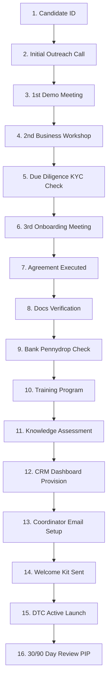

# Onboarding Workflow & Pipeline

# Document Information
- **Document Name**: Onboarding Workflow
- **Purpose**: Outline the end-to-end 16-stage candidate onboarding progression flow.
- **Target Audience**: HR Teams, District Heads, Candidates.
- **Owner**: Operations Director
- **Version**: 1.0.0
- **Last Updated**: 2026-07-18
- **Review Frequency**: Semi-annually
- **Related Documents**:
  - [01-Onboarding-Overview.md](01-Onboarding-Overview.md)

---

## 🏛️ Executive Summary
This document charts out the progression roadmap from first candidate identification to 90-day review.

## 🔄 Onboarding Lifecycle Flowchart

---

## 🏁 Review Checklist
- [ ] Confirm flowchart stages align with CRM dashboard states.
- [ ] Validate relative links resolve correctly.
