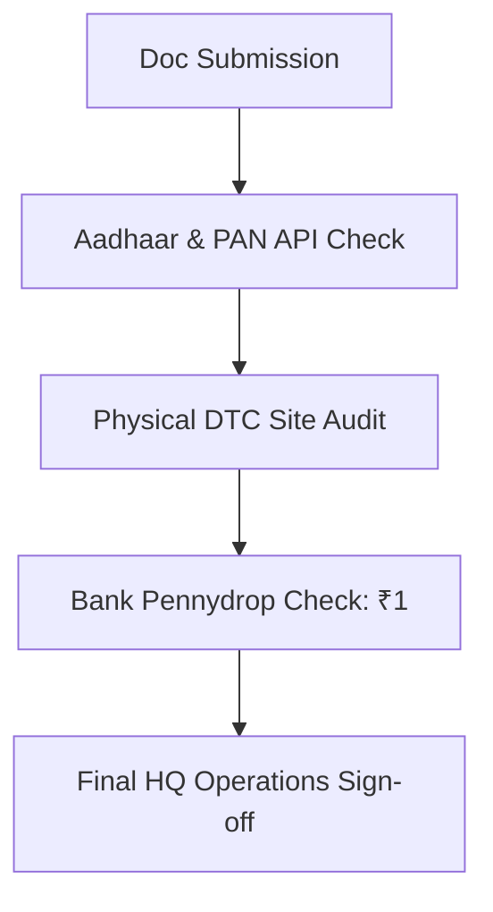

# KYC Verification Requirements

# Document Information
- **Document Name**: KYC Verification Requirements
- **Purpose**: Document the verification procedures, Pennydrop checks, and site audits required to approve a partner.
- **Target Audience**: District Heads, Auditing Managers.
- **Owner**: Compliance Director
- **Version**: 1.0.0
- **Last Updated**: 2026-07-18
- **Review Frequency**: Annually
- **Related Documents**:
  - [02-Document-Checklist.md](02-Document-Checklist.md)
  - [11-Bank-Details-Form.md](11-Bank-Details-Form.md)

---

## 🏛️ Executive Summary
KYC vetting ensures that only certified operators enter the DnyanMitra network, preventing duplicate logins or fraudulent vendor billing rings.

## ⚙️ Verification Pipeline Steps

### 1. Bank Verification
- **Pennydrop Check**: A microtransaction of ₹1.00 is routed to verify that the name matches the applicant's PAN card.

### 2. Site Audit
- **Physical Site Visit**: The District Head must visit the candidate's proposed office or training centre, verifying classroom space and signage availability.

---

## 🏁 Review Checklist
- [ ] Verify that the site visit photo includes GPS latitude/longitude stamps.
- [ ] Check bank account validation status in CRM console.
