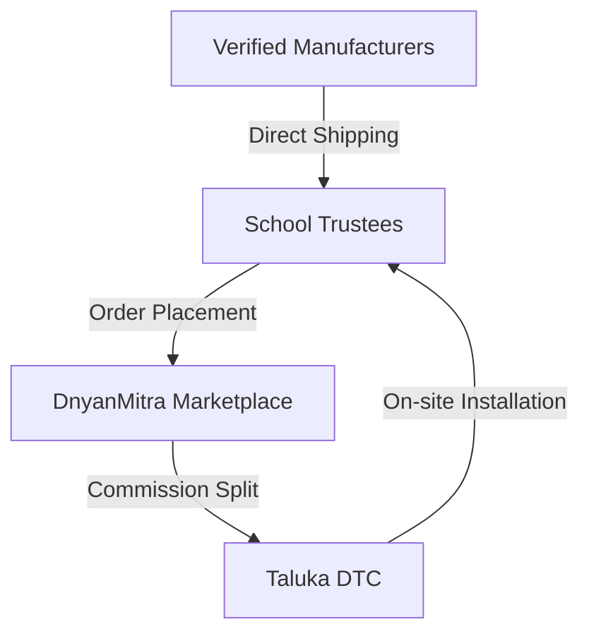

# DnyanMitra Marketplace Overview

# Document Information
- **Document Name**: DnyanMitra Marketplace Overview
- **Purpose**: Map B2B marketplace transaction pools and DTC operational nodes.
- **Target Audience**: Partners, FSE staff, District Heads.
- **Owner**: Marketplace Director
- **Version**: 1.0.0
- **Last Updated**: 2026-07-18
- **Review Frequency**: Annually
- **Related Documents**:
  - [01-Company-Profile.md](01-Company-Profile.md)

---

## 🏛️ Executive Summary
DnyanMitra connects schools directly with manufacturers for classroom desks, uniforms, smart boards, and sports equipment, saving costs for educational trusts.

## 🤝 Platform Stakeholder Matrix

---

## 🏁 Review Checklist
- [ ] Verify that manufacturer list matches active portal registers.
